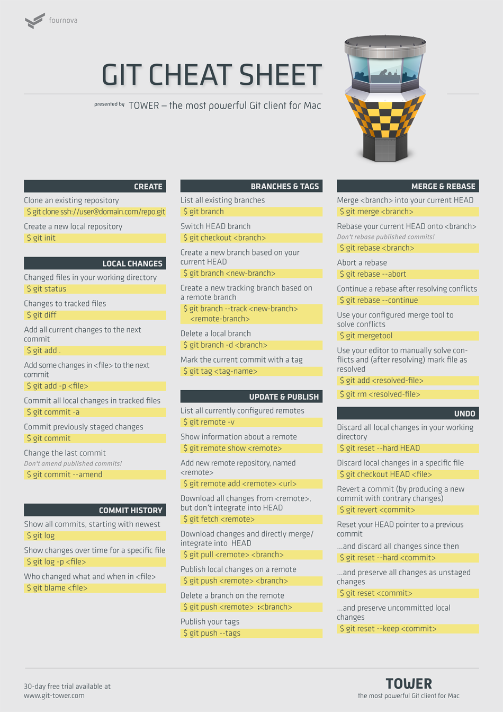

## 浅显易懂的Git教程

### 目录
1. Git简介
2. 安装Git
3. 创建版本库
4. 时光机穿梭
5. 远程仓库
6. 分支管理
7. 标签管理
8. 使用GitHub
9. 自定义Git
10. 搭建Git服务器

### 1. Git简介
Git是什么？Git是目前世界上最先进的分布式版本控制系统（没有之一）。

#### 1.1 Git的诞生
2005年，Linus花了两周时间自己用C写了一个分布式版本控制系统，这就是Git！一个月之内，Linux系统的源码已经由Git管理了。Git迅速成为最流行的分布式版本控制系统，尤其是2008年，GitHub网站上线了，它为开源项目免费提供Git存储，无数开源项目开始迁移至GitHub，包括jQuery，PHP，Ruby等等。

#### 1.2 集中式vs分布式
Linus一直痛恨的CVS及SVN都是集中式的版本控制系统，而Git是分布式版本控制系统，集中式和分布式版本控制系统有什么区别呢？

先说集中式版本控制系统，版本库是集中存放在中央服务器的，而干活的时候，用的都是自己的电脑，所以要先从中央服务器取得最新的版本，然后开始干活，干完活了，再把自己的活推送给中央服务器。分布式版本控制系统根本没有“中央服务器”，每个人的电脑上都是一个完整的版本库，这样，你工作的时候，就不需要联网了，因为版本库就在你自己的电脑上。

### 2. Git安装

#### 2.1 linux
首先，你可以试着输入git，看看系统有没有安装Git：
```
$ git
The program 'git' is currently not installed. You can install it by typing:
$ sudo apt-get install git
```
像上面的命令，有很多Linux会友好地告诉你Git没有安装，还会告诉你如何安装Git。
如果你碰巧用Debian或Ubuntu Linux，通过一条`sudo apt-get install git`就可以直接完成Git的安装，非常简单。老一点的Debian或Ubuntu Linux，要把命令改为`sudo apt-get install git-core`，因为以前有个软件也叫GIT（GNU Interactive Tools），结果Git就只能叫git-core了。由于Git名气实在太大，后来就把GNU Interactive Tools改成gnuit，git-core正式改为git。如果是其他Linux版本，可以直接通过源码安装。先从Git官网下载源码，然后解压，依次输入：`./config，make，sudo make install`这几个命令安装就好了。

#### 2.2 Mac OS
Mac做开发，有两种安装Git的方法:

1. 一是安装homebrew，然后通过homebrew安装Git，具体方法请参考homebrew的文档：http://brew.sh/。

2. 第二种方法更简单，也是推荐的方法，就是直接从AppStore安装Xcode，Xcode集成了Git，不过默认没有安装，你需要运行Xcode，选择菜单“Xcode”->“Preferences”，在弹出窗口中找到“Downloads”，选择“Command Line Tools”，点“Install”就可以完成安装了。

#### 2.3 Windows
msysgit是Windows版的Git，从http://msysgit.github.io/ 下载，然后按默认选项安装即可。安装完成后，在开始菜单里找到“Git”->“Git Bash”，蹦出一个类似命令行窗口的东西，就说明Git安装成功！

#### 2.4 安装Git完成后的初始设置

	$ git config --global user.name "Your Name"
	$ git config --global user.email "email@example.com" 
	
因为Git是分布式版本控制系统，所以，每个机器都必须自报家门：你的名字和Email地址。

注意:git config命令的--global参数，用了这个参数，表示你这台机器上所有的Git仓库都会使用这个配置，当然也可以对某个仓库指定不同的用户名和Email地址。


### 3. 创建版本库

#### 3.1 初始化目录为可管理的仓库
执行 **git init** 命令，在目录下生成一个.git 文件。

`$ git init `

#### 3.2 添加文本文件到版本库
第一步，通过 **git add**  命令把文件添加到仓库

`$ git add file.txt`

第二步，通过 **git commit** 命令把文本文件提交到仓库

`$ git commit -m "wrote a text file"`

*其中 -m后是本次提交的说明*  

为什么Git添加文件需要 add，commit两步呢？其中原因之一为 commit 可以一次提交很多文件，所以可以多次 add 不同的文件，比如

	$ git add file1.txt
	$ git add file2.txt
	$ git add file3.txt
	$ git commit -m "add 3 files."
##### 小结
1. 初始化一个Git仓库，使用`git init`命令。
2. 添加文件到Git仓库，分两步：
	+ 第一步，使用命令`git add filename`，注意，可反复多次使用，添加多个文件；
	+ 第二步，使用命令`git commit –m “record.omfp`，完成。

	
### 4. 时光机穿梭

#### 4.1 仓库状态查看
第一步，**git status** 命令可以时刻掌控仓库状态，监控文件修改情况

`$ git status`  

第二步，**git diff** 命令查看文件修改详情

`$ git diff modified.txt`  

第三步，**git add** 命令添加文件到仓库

`$ git add modified.txt`   

第四步，**git status** 命令查看待提交文件信息

`$ git status`  

第五步，**git commit -m ""** 命令提交文件
	
`$ git commit -m "modify file modified.txt"`
  
第六步，**git status** 命令查看仓库的当前状态

`$ git status`  

Git会告诉我们当前没有需要提交的修改，工作目录是干净的。

###### 小结
+ 要随时掌握工作区的状态，使用`git status`命令。
+ 如果git status告诉你有文件被修改过，用`git diff`可以查看修改内容。


#### 4.2 版本回退

第一步，**git log** 命令查看历史信息

	$ git log
	commit 3618dh8724779dfdj8e8797
	author: xxx <xxx#email.com>
	Date: xxxx
	note.information
	
`git log` 命令显示从最近到最远的的提交日志。如果觉得输出信息过多，可以添加 --pretty=oneline 参数简化信息

	$ git log --pretty=oneline
	618dh8724779dfdj8e8797  note.information
	
*其中长字符串“618dh8724779dfdj8e8797”是十六进制的 commit id.*

文件版本简介
> 在Git中，**用HEAD表示当前版本**，也就是最新提交的"618dh8.....dfdj8e8797"，**上一版本就是HEAD^**，上上一个版本是HEAD^^，………往上100个版本是HEAD~100

第二步，**git reset** 命令回退到指定版本

	$ git reset --hard HEAD^
	$ cat file.txt  #查看文件内容
	$ git log #回退版本以后的历史记录不见了
	
原来的最新版本已经消失了，好比从21世纪穿越到19世纪，就会回不来了。其实还是可以穿越回来的，就是找到相应版本的commit id，就可以指定回到未来的某个版本

	$ git reset --hard xxxxxxx   #commit id/版本号没有必要写全，前几位就可以了
	
如果无法找到commit id，可用 **git reflog** 命令查看命令历史记录

	$ git reflog
	xxxxx HEAD@(0): reset: move to HEAD^
	xxxxx HEAD@(1):commit: note.information ##这样就可以找到未来版本号了
	…………

##### 小结

+ HEAD指向的版本就是当前版本，因此，Git允许我们在版本的历史之间穿梭，使用命令`git reset --hard commit_id`。
+ 穿梭前，用`git log`可以查看提交历史，以便确定要回退到哪个版本。
+ 要重返未来，用`git reflog`查看命令历史，以便确定要回到未来的哪个版本。

#### 4.3 工作区和暂存区

Git和其他版本控制系统如SVN的一个不同之处就是有暂存区的概念。**工作区**（Working Directory）：就是你在电脑里能看到的目录，比如我的learngit文件夹就是一个工作区；而**版本库**（Repository）则是工作区一个隐藏目录“.git”。

Git的版本库里存了很多东西，其中最重要的就是称为stage（或者叫index）的暂存区，还有Git为我们自动创建的第一个分支master，以及指向master的一个指针叫HEAD。

把文件往Git版本库里添加的时候，是分两步执行的：

	第一步是用“git add”把文件添加进去，实际上就是把文件修改添加到暂存区；
	第二步是用“git commit”提交更改，实际上就是把暂存区的所有内容提交到当前分支。
因为我们创建Git版本库时，Git自动为我们创建了唯一一个master分支，所以，现在，commit就是往master分支上提交更改。

![git Repository] (./Git.Repository.structure.jpg)

#### 4.4 管理修改
Git跟踪并管理的是修改，而非文件。

Git管理的是修改，当你用`git add`命令后，在工作区的第一次修改被放入暂存区，准备提交，但是，在工作区的第二次修改并没有放入暂存区，所以，`git commit`只负责把暂存区的修改提交了，也就是第一次的修改被提交了，第二次的修改不会被提交。

提交后，用`git diff HEAD -- file`命令可以查看工作区和版本库里面最新版本的区别。

#### 4.5 撤销修改
`git checkout -- file` 可以丢弃工作区的修改，把文件在工作区的修改全部撤销，这里有两种情况：

1. 一种是文件自修改后还没有被放到暂存区，现在，撤销修改就回到和版本库一模一样的状态；
2. 一种是文件已经添加到暂存区后，又作了修改，现在，撤销修改就回到添加到暂存区后的状态。

总之，就是让这个文件回到最近一次git commit或git add时的状态。

> 命令中的“--”很重要，没有“--”，就变成了“创建一个新分支”的命令。

用命令`git reset HEAD file`可以把暂存区的修改撤销掉（unstage），重新放回工作区。`git reset`命令既可以回退版本，也可以把暂存区的修改回退到工作区。当我们用HEAD时，表示最新的版本。

#### 4.6 删除文件
直接在文件管理器中把没用的文件删了，或者用rm命令删了之后，有两个选择：
1. 一是确实要从版本库中删除该文件，那就用命令`git rm`删掉，并且commit；
2. 另一种情况是删错了，因为版本库里还有，所以可以把误删的文件恢复到最新版本：`$ git checkout -- file`,`git checkout`其实是用版本库里的版本替换工作区的版本，无论工作区是修改还是删除，都可以“一键还原”。

##### 小结
命令`git rm`用于删除一个文件。如果一个文件已经被提交到版本库，那么你永远不用担心误删，但是要小心，你只能恢复文件到最新版本，你会丢失最近一次提交后你修改的内容。


### 5. 远程仓库

#### 5.1 初始设置
注册GitHub账号后，由于本地Git仓库和GitHub仓库之间的传输是通过SSH加密的，所以，需要一些初始设置：

1. 第1步：创建**SSH Key**。在用户主目录下，如没有.ssh目录，打开Shell（Windows下打开Git Bash），创建SSH Key：   

`$ ssh-keygen -t rsa -C youremail@example.com`

    如果一切顺利的话，可以在用户主目录里找到.ssh目录，里面有id_rsa和id_rsa.pub两个文件，这两个就是SSH Key的秘钥对，id_rsa是私钥，不能泄露出去，id_rsa.pub是公钥，可以放心地告诉任何人。
    
2. 登陆GitHub，打开“Account settings”，“SSH Keys”页面，然后，点“Add SSH Key”，填上任意Title，在Key文本框里粘贴id_rsa.pub文件的内容。

GitHub允许你添加多个Key，只要把每台电脑的Key都添加到GitHub，就可以在每台电脑上往GitHub推送了。

最后友情提示，在GitHub上免费托管的Git仓库，任何人都可以看到喔（但只有你自己才能改）。所以，不要把敏感信息放进去。


#### 5.1 添加远程库
在本地创建了一个Git仓库后，又想在GitHub创建一个Git仓库，并且让这两个仓库进行远程同步，这样，GitHub上的仓库既可以作为备份，又可以让其他人通过该仓库来协作，真是一举多得。

1. 第一步，登陆GitHub，然后在右上角找到"Creat a new repo"按钮，创建新的仓库。在Repository name填入与本地仓库同名，最后按照默认设置完成创建。

2. 第二步，根据GitHub提示在本地仓库下运行命令**git remote add origin <url\>** 即可将本地仓库与远程仓库相关联。

`$ git remote add origin git@github.com:username/repo.name.git #推荐（速度快）`

或者运行

`$ git remote add origin https://github.com/username/repo.name.git`

实际上，Git支持多种协议，默认的git://使用ssh，但也可以使用https等其他协议。使用https除了速度慢以外，还有个最大的麻烦是每次推送都必须输入口令，但是在某些只开放http端口的公司内部就无法使用ssh协议而只能用https。

如果出现以下出错信息

`fatal: remote origin already exists.`

此时需要运行命令 **git remote rm origin** 后再重新运行上步关联命令。

`$ git remote rm origin`

第三步，将本地库中的所有内容推送到远程库上，命令为 **git push -u origin master** 

`$ git push -u origin master`
	
> 用git push命令实际上是把当前分支master推送到远程。由于远程库是空的，我们第一次推送master分支时，加上了-u参数，Git不但会把本地的master分支内容推送的远程新的master分支，还会把本地的master分支和远程的master分支关联起来，在以后的推送或者拉取时就可以简化命令为`git push origin master`或`git push`.


> 定义远程服务器别名origin：`$ git remote add origin git@github.com:xxx/github-test.git`.本地和远程实行合并，本地默认为master:`$ git push origin master`;而当通过Github以xxx对github-test作出修改时，由于本地快照与Github远程服务器上的不一致，会引起以下错误：

	```
	! [rejected]        master -> master (fetch first) 
	error: failed to push some refs to 'git@github.com:xxx/puppet' 
	hint: Updates were rejected because the remote contains work that 	you do 
	hint: not have locally. This is usually caused by another repository pushing 
	hint: to the same ref. You may want to first integrate the remote changes 
	hint: (e.g., 'git pull ...') before pushing again. 
	hint: See the 'Note about fast-forwards' in 'git push --help' for details.
	```
> 此时可①通过pull子命令更新Github项目中作出的更改：`$ git pull origin master`,之后再执行`$ git push origin master`;②可用`git push -f`进行强制上传覆盖。

#### 5.2 克隆远程库
可用命令`git clone git@github.com:username/repo.name.git`将一个远程库克隆到本地。

+ 要克隆一个仓库，首先必须知道仓库的地址，然后使用`git clone`命令克隆。

+ Git支持多种协议，包括https，但通过ssh支持的原生git协议速度最快。

### 6. 分支管理

#### 6.1 创建和合并分支
目前，git仅有一条时间线，这个分支是主分支，即master分支。HEAD严格来说不是指向提交，而是指向master，master才是指向提交的，所以，HEAD指向的就是当前分支。

首先，我们创建dev分支，然后切换到dev分支：

	$ git checkout -b dev
	Switched to a new branch 'dev'

`git checkout`命令加上`-b`参数表示创建并切换，相当于以下两条命令：
```
$ git branch dev
$ git checkout dev
Switched to branch 'dev'
```

然后，用`git branch`命令查看当前分支：
```
$ git branch
* dev
  master
```
`git branch`命令会列出所有分支，当前分支前面会标一个*号。

待dev分支的工作完成(修改-add-commit)，我们就可以切换回master分支：
```
$ git checkout master
Switched to branch 'master'
```
还要把dev分支的工作成果合并到master分支上：`$ git merge dev`。其实，`git merge`命令合并指定分支到当前分支。

合并完成后，就可以放心地删除dev分支了：
```
$ git branch -d dev
Deleted branch dev (was fec145a).
```

删除后，查看branch，就只剩下master分支了。因为创建、合并和删除分支非常快，所以Git鼓励你使用分支完成某个任务，合并后再删掉分支，这和直接在master分支上工作效果是一样的，但过程更安全。

##### 小结

Git鼓励大量使用分支：
+ 查看分支：git branch
+ 创建分支：git branch name
+ 切换分支：git checkout name
+ 创建+切换分支：git checkout -b name
+ 合并某分支到当前分支：git merge name
+ 删除分支：git branch -d name

#### 6.2 解决冲突

当两个合并的分支中文件都具有新的修改时会无法进行“快速合并”，只能试图把各自的修改合并起来，但这种合并就可能会有冲突。直接查看readme.txt的内容时，Git用<<<<<<<，=======，>>>>>>>标记出不同分支的内容，我们修改后保存，再提交即可。

用带参数的`git log`也可以看到分支的合并情况：  

`$ git log --graph --pretty=oneline --abbrev-commit`.

##### 小结
+ 当Git无法自动合并分支时，就必须首先解决冲突。解决冲突后，再提交，合并完成。
+ 用`git log --graph`命令可以看到分支合并图。

#### 6.3 分支管理策略
通常，合并分支时，如果可能，Git会用“Fast forward”模式，但这种模式下，删除分支后，会丢掉分支信息。如果要强制禁用“Fast forward”模式，Git就会在merge时生成一个新的commit，这样，从分支历史上就可以看出分支信息。例如：准备合并dev分支，请注意--no-ff参数，表示禁用“Fast forward”：

`$ git merge --no-ff -m "merge with no-ff" dev`

> 因为本次合并要创建一个新的commit，所以加上-m参数，把commit描述写进去。

##### 6.3.1 分支策略
在实际开发中，我们应该按照几个基本原则进行分支管理：

首先，master分支应该是非常稳定的，也就是仅用来发布新版本，平时不能在上面干活；

其次，干活都在dev分支上，也就是说，dev分支是不稳定的，到某个时候，比如1.0版本发布时，再把dev分支合并到master上，在master分支发布1.0版本；

再者，每个人都在自己的dev分支上干活，每个人都有自己的分支，时不时地往dev分支上合并就可以了。

###### 小结
+ Git分支十分强大，在团队开发中应该充分应用。
+ 合并分支时，加上--no-ff参数就可以用普通模式合并，合并后的历史有分支，能看出来曾经做过合并，而fast forward合并就看不出来曾经做过合并。

##### 6.3.2 Bug分支
软件开发中，有了bug就需要修复。在Git中，由于分支是如此的强大，所以，每个bug都可以通过一个新的临时分支来修复，修复后，合并分支，然后将临时分支删除。

当你接到一个修复一个代号101的bug的任务时，很自然地，你想创建一个分支issue -101来修复它，但是，等等，当前正在dev上进行的工作还没有提交。并不是你不想提交，而是工作只进行到一半，还没法提交，预计完成还需1天时间。但是，必须在两个小时内修复该bug，怎么办？

幸好，Git还提供了一个stash功能，可以把当前工作现场“储藏”起来，等以后恢复现场后继续工作：`$ git stash`.此时，所在分支的工作区就变得干净了，可以可以放心地创建分支来修复bug。

首先确定要在哪个分支上修复bug，假定需要在master分支上修复，就从master创建临时分支：
```
$ git checkout master
$ git checkout -b issue-101
.....(fix bug)
$ git add readme.txt 
$ git commit -m "fix bug 101"
$ git checkout master
$ git merge --no-ff -m "merged bug fix 101" issue-101
$ git branch -d issue-101
$ git checkout dev #回原先的分支继续干活
```
用`git stash list`命令看看原先的工作现场后，可以看到工作现场还在，Git把stash内容存在某个地方了，但是需要恢复一下，有两个办法：

+ 一是用`git stash apply`恢复，但是恢复后，stash内容并不删除，你需要用`git stash drop`来删除；
+ 另一种方式是用`git stash pop`，恢复的同时把stash内容也删了.

再用`git stash list`查看，就看不到任何stash内容了.

你可以多次stash，恢复的时候，先用git stash list查看，然后恢复指定的stash，用命令：

`$ git stash apply stash@{0}`

###### 小结

+ 修复bug时，我们会通过创建新的bug分支进行修复，然后合并，最后删除；
+ 当手头工作没有完成时，先把工作现场`git stash`一下，然后去修复bug，修复后，再`git stash pop`，回到工作现场。

##### 6.3.3 Feature分支

软件开发中，添加一个新功能时，不希望因为一些实验性质的代码，把主分支搞乱了，所以，每添加一个新功能，最好新建一个feature分支，在上面开发，完成后，合并，最后，删除该feature分支。现在，你终于接到了一个新任务：开发代号为Vulcan的新功能，该功能计划用于下一代星际飞船。于是准备开发：  

`$ git checkout -b feature-vulcan`

当开发完毕并提交后，切回主分支并准备进行合并：`$ git checkout dev`，但接到上级命令，因经费不足，新功能必须取消！虽然白干了，但是这个分支还是必须就地销毁：`$ git branch -d feature-vulcan`，销毁失败。Git友情提醒，feature-vulcan分支还没有被合并，如果删除，将丢失掉修改，如果要强行删除，需要使用命令`git branch -D feature-vulcan`。现在强行删除：

`$ git branch -D feature-vulcan`

###### 小结
+ 开发一个新feature，最好新建一个分支；
+ 如果要丢弃一个没有被合并过的分支，可以通过git branch -D name强行删除。

#### 6.4 多人协作
当你从远程仓库克隆时，实际上Git自动把本地的master分支和远程的master分支对应起来了，并且，远程仓库的默认名称是origin。要查看远程库的信息，用`git remote`：
```
$ git remote
origin
```
或者，用`git remote -v`显示更详细的信息：
```
$ git remote -v
origin  git@github.com:michaelliao/learngit.git (fetch)
origin  git@github.com:michaelliao/learngit.git (push)
```
上面显示了可以抓取和推送的origin的地址。如果没有推送权限，就看不到push的地址。

##### 6.4.1 推送分支
推送分支，就是把该分支上的所有本地提交推送到远程库。推送时，要指定本地分支，这样，Git就会把该分支推送到远程库对应的远程分支上：

`$ git push origin master`

如果要推送其他分支，比如dev，就改成：

`$ git push origin dev`

但是，并不是一定要把本地分支往远程推送，那么，哪些分支需要推送，哪些不需要呢？

+ master分支是主分支，因此要时刻与远程同步；
+ dev分支是开发分支，团队所有成员都需要在上面工作，所以也需要与远程同步；
+ bug分支只用于在本地修复bug，就没必要推到远程了；
+ feature分支是否推到远程，取决于是否合作在上面开发。

##### 6.4.2 抓取分支
多人协作时，大家都会往master和dev分支上推送各自的修改。从远程库clone时，默认情况下，只能看到本地的master分支。可以用git branch命令查看。

若要在dev分支上开发，就必须创建远程origin的dev分支到本地，于是他用这个命令创建本地dev分支：  

`$ git checkout -b dev origin/dev`  

现在，就可以在dev上继续修改，然后，时不时地把dev分支push到远程。你的小伙伴已经向origin/dev分支推送了他的提交，而碰巧你也对同样的文件作了修改，并试图推送，但推送失败，因为你的小伙伴的最新提交和你试图推送的提交有冲突，解决办法也很简单，Git已经提示我们，先用git pull把最新的提交从origin/dev抓下来，然后，在本地合并，解决冲突，再推送：`$ git pull`。`git pull`也失败了，原因是没有指定本地dev分支与远程origin/dev分支的链接，根据提示，设置dev和origin/dev的链接：  

`$ git branch --set-upstream dev origin/dev`  

`$ git pull`  

这回`git pull`成功，但是合并有冲突，需要手动解决，解决的方法和**分支管理**中的解决冲突完全一样。解决后，提交，再push。

因此，多人协作的工作模式通常是这样：

1.	首先，可以试图用`git push origin branch-name`推送自己的修改；
2.	如果推送失败，则因为远程分支比你的本地更新，需要先用`git pull`试图合并；
3.	如果合并有冲突，则解决冲突，并在本地提交；
4.	没有冲突或者解决掉冲突后，再用`git push origin branch-name`推送就能成功！

如果`git pull`提示“`no tracking information`”，则说明本地分支和远程分支的链接关系没有创建，用命令`git branch --set-upstream branch-name origin/branch-name`。

这就是多人协作的工作模式，一旦熟悉了，就非常简单。
##### 小结
+ 查看远程库信息，使用`git remote -v`；
+ 本地新建的分支如果不推送到远程，对其他人就是不可见的；
+ 从本地推送分支，使用`git push origin branch-name`，如果推送失败，先用`git pull`抓取远程的新提交；
+ 在本地创建和远程分支对应的分支，使用`git checkout -b branch-name origin/branch-name`，本地和远程分支的名称最好一致；
+ 建立本地分支和远程分支的关联，使用`git branch --set-upstream branch-name origin/branch-name`；
+ 从远程抓取分支，使用`git pull`，如果有冲突，要先处理冲突。

### 7. 标签管理

发布一个版本时，我们通常先在版本库中打一个标签，这样，就唯一确定了打标签时刻的版本。将来无论什么时候，取某个标签的版本，就是把那个打标签的时刻的历史版本取出来。所以，标签也是版本库的一个快照。Git的标签虽然是版本库的快照，但其实它就是指向某个commit的指针（跟分支很像对不对？但是分支可以移动，标签不能移动），所以，创建和删除标签都是瞬间完成的。

#### 7.1 创建标签
在Git中打标签非常简单，首先，切换到需要打标签的分支上：

```
$ git branch
* dev
  master
$ git checkout master
Switched to branch 'master'
```

然后，敲命令`git tag name`就可以打一个新标签：

`$ git tag v1.0`

可以用命令`git tag`查看所有标签。

默认标签是打在最新提交的commit上的。有时候，如果忘了打标签，怎么办？
方法是找到历史提交的commit id，然后打上就可以了：

```
$ git log --pretty=oneline --abbrev-commit
$ git tag v0.9 commit_id
```

用命令`git tag`查看标签，标签不是按时间顺序列出，而是按字母排序的。可以用`git show tagname`查看标签信息。

此外，还可以创建带有说明的标签，用`-a`指定标签名，`-m`指定说明文字，如：

`$ git tag -a v0.1 -m "version 0.1 released" commit_id`

用命令`git show tagname`可以看到说明文字。

还可以通过`-s`用私钥签名一个标签：

`$ git tag -s v0.2 -m "signed version 0.2 released" commit_id`

由于签名采用PGP签名，因此，必须首先安装gpg（GnuPG），如果没有找到gpg，或者没有gpg密钥对，就会报错。

##### 小结
+ 命令`git tag name`用于新建一个标签，默认为HEAD，也可以指定一个`commit id`；
+ `git tag -a tagname -m "blablabla..."`可以指定标签信息；
+ `git tag -s tagname -m "blablabla..."`可以用PGP签名标签；
+ 命令`git tag`可以查看所有标签；

#### 7.2 操作标签
如果标签打错了，也可以删除：`$ git tag -d v0.1`.

因为创建的标签都只存储在本地，不会自动推送到远程。所以，打错的标签可以在本地安全删除。

如果要推送某个标签到远程，使用命令`git push origin tagname`.或者，一次性推送全部尚未推送到远程的本地标签：`$ git push origin --tags`.

如果标签已经推送到远程，要删除远程标签就麻烦一点，先从本地删除：`$ git tag -d v0.9`;

然后，从远程删除。删除命令也是push，但是格式如下：`$ git push origin :refs/tags/v0.9`

##### 小结
+ 命令`git push origin tagname`可以推送一个本地标签；
+ 命令`git push origin --tags`可以推送全部未推送过的本地标签；
+ 命令`git tag -d tagname`可以删除一个本地标签；
+ 命令`git push origin :refs/tags/tagname`可以删除一个远程标签。

### 8. 使用GitHub

如何参与一个开源项目呢？比如人气极高的bootstrap项目，这是一个非常强大的CSS框架，你可以访问它的项目主页https://github.com/twbs/bootstrap，点“Fork”就在自己的账号下克隆了一个bootstrap仓库，然后，从自己的账号下clone：

`$ git clone git@github.com:michaelliao/bootstrap.git`

一定要从自己的账号下clone仓库，这样你才能推送修改。如果从bootstrap的作者的仓库地址git@github.com:twbs/bootstrap.git克隆，因为没有权限，你将不能推送修改。
Bootstrap的官方仓库twbs/bootstrap、你在GitHub上克隆的仓库my/bootstrap，以及你自己克隆到本地电脑的仓库。
 
如果你想修复bootstrap的一个bug，或者新增一个功能，立刻就可以开始干活，干完后，往自己的仓库推送。

如果你希望bootstrap的官方库能接受你的修改，你就可以在GitHub上发起一个pull request。当然，对方是否接受你的pull request就不一定了。

如果你没能力修改bootstrap，但又想要试一把pull request，那就Fork一下我的仓库：https://github.com/michaelliao/learngit， 创建一个your-github-id.txt的文本文件，写点自己学习Git的心得，然后推送一个`pull request`给我，我会视心情而定是否接受。

#### 小结
+ 在GitHub上，可以任意Fork开源仓库；
+ 自己拥有Fork后的仓库的读写权限；
+ 可以推送pull request给官方仓库来贡献代码。

### 10. 自定义Git

在安装Git一节中，我们已经配置了user.name和user.email，实际上，Git还有很多可配置项。比如，让Git显示颜色，会让命令输出看起来更醒目：

`$ git config --global color.ui true`

这样，Git会适当地显示不同的颜色，比如git status命令：

#### 10.1 忽略特殊文件

有些时候，你必须把某些文件放到Git工作目录中，但又不能提交它们，比如保存了数据库密码的配置文件啦，等等，每次`git status`都会显示`“Untracked files ...”`，有强迫症的童鞋心里肯定不爽。

好在Git考虑到了大家的感受，这个问题解决起来也很简单，在Git工作区的根目录下创建一个特殊的.gitignore文件，然后把要忽略的文件名填进去，Git就会自动忽略这些文件。

不需要从头写.gitignore文件，GitHub已经为我们准备了各种配置文件，只需要组合一下就可以使用了。所有配置文件可以直接在线浏览：https://github.com/github/gitignore

忽略文件的原则是：

1.	忽略操作系统自动生成的文件，比如缩略图等；
2.	忽略编译生成的中间文件、可执行文件等，也就是如果一个文件是通过另一个文件自动生成的，那自动生成的文件就没必要放进版本库，比如Java编译产生的.class文件；
3.	忽略你自己的带有敏感信息的配置文件，比如存放口令的配置文件。

加上你自己定义的文件，最终得到一个完整的.gitignore文件，内容如下：
```
# Windows:
Thumbs.db
ehthumbs.db
Desktop.ini

# Python:
*.py[cod]
*.so
*.egg
*.egg-info
dist
build

# My configurations:
db.ini
deploy_key_rsa
```

最后一步就是把.gitignore也提交到Git，就完成了！当然检验.gitignore的标准是`git status`命令是不是说“working directory clean”。

使用Windows的童鞋注意了，如果你在资源管理器里新建一个.gitignore文件，它会非常弱智地提示你必须输入文件名，但是在文本编辑器里“保存”或者“另存为”就可以把文件保存为.gitignore了。

##### 小结
1.	忽略某些文件时，需要编写.gitignore。
2.	.gitignore文件本身要放到版本库里，并且可以对.gitignore做版本管理！

#### 10.2 配置别名

有没有经常敲错命令？比如git status？status这个单词真心不好记。如果敲`git st`就表示`git status`那就简单多了，当然这种偷懒的办法我们是极力赞成的。其实，我们只需要敲一行命令，告诉Git，以后st就表示status：

`$ git config --global alias.st status`

+ 当然还有别的命令可以简写，很多人都用co表示checkout，ci表示commit，br表示branch:
```
$ git config --global alias.co checkout
$ git config --global alias.ci commit
$ git config --global alias.br branch
```

--global参数是全局参数，也就是这些命令在这台电脑的所有Git仓库下都有用。

+ 在撤销修改一节中，我们知道，命令`git reset HEAD file`可以把暂存区的修改撤销掉（unstage），重新放回工作区。既然是一个unstage操作，就可以配置一个unstage别名：

`$ git config --global alias.unstage 'reset HEAD'`

当你敲入命令：`$ git unstage test.py`,实际上Git执行的是：`$ git reset HEAD test.py`.

+ 配置一个`git last`，让其显示最后一次提交信息：`$ git config --global alias.last 'log -1'`.

+ 还有人丧心病狂地把lg配置成了：
`git config --global alias.lg "log --color --graph --pretty=format:'%Cred%h%Creset -%C(yellow)%d%Creset %s %Cgreen(%cr) %C(bold blue)<%an>%Creset' --abbrev-commit"`

##### 小结
给Git配置好别名，就可以输入命令时偷个懒。我们鼓励偷懒。

### 11. 搭建Git服务器


GitHub就是一个免费托管开源代码的远程仓库。但是对于某些视源代码如生命的商业公司来说，既不想公开源代码，又舍不得给GitHub交保护费，那就只能自己搭建一台Git服务器作为私有仓库使用。

#### 11.1 安装Git

搭建Git服务器需要准备一台运行Linux的机器，强烈推荐用Ubuntu或Debian，这样，通过几条简单的apt命令就可以完成安装。

假设你已经有sudo权限的用户账号，下面，正式开始安装。

1. 第一步，安装git：`$ sudo apt-get install git`
2. 第二步，创建一个git用户，用来运行git服务：`$ sudo adduser git`
3. 第三步，创建证书登录：收集所有需要登录的用户的公钥，就是他们自己的id_rsa.pub文件，把所有公钥导入到/home/git/.ssh/authorized_keys文件里，一行一个;
4. 第四步，初始化Git仓库：先选定一个目录作为Git仓库，假定是/srv/sample.git，在/srv目录下输入命令：`$ sudo git init --bare sample.git`,Git就会创建一个裸仓库，裸仓库没有工作区，因为服务器上的Git仓库纯粹是为了共享，所以不让用户直接登录到服务器上去改工作区，并且服务器上的Git仓库通常都以.git结尾。然后，把owner改为git：`$ sudo chown -R git:git sample.git`;
5. 第五步，禁用shell登录：出于安全考虑，第二步创建的git用户不允许登录shell，这可以通过编辑/etc/passwd文件完成。找到类似下面的一行：`git:x:1001:1001:,,,:/home/git:/bin/bash`改为：`git:x:1001:1001:,,,:/home/git:/usr/bin/git-shell`;这样，git用户可以正常通过ssh使用git，但无法登录shell，因为我们为git用户指定的git-shell每次一登录就自动退出;
6. 第六步，克隆远程仓库：现在，可以通过git clone命令克隆远程仓库了，在各自的电脑上运行：`$ git clone git@server:/srv/sample.git`;

```
	Cloning into 'sample'...
	warning: You appear to have cloned an empty repository.
```

#### 11.2 管理公钥

如果团队很小，把每个人的公钥收集起来放到服务器的/home/git/.ssh/authorized_keys文件里就是可行的。如果团队有几百号人，就没法这么玩了，这时，可以用Gitosis来管理公钥。

#### 11.3 管理权限

有很多不但视源代码如生命，而且视员工为窃贼的公司，会在版本控制系统里设置一套完善的权限控制，每个人是否有读写权限会精确到每个分支甚至每个目录下。因为Git是为Linux源代码托管而开发的，所以Git也继承了开源社区的精神，不支持权限控制。

不过，因为Git支持钩子（hook），所以，可以在服务器端编写一系列脚本来控制提交等操作，达到权限控制的目的。Gitolite就是这个工具。

##### 小结

+ 搭建Git服务器非常简单，通常10分钟即可完成；
+ 要方便管理公钥，用Gitosis；
+ 要像SVN那样变态地控制权限，用Gitolite。

### 12. 期末总结

一开始，Git上手比较困难，尤其是已经熟悉SVN的童鞋，没关系，多操练几次，就会越用越顺手。

Git虽然极其强大，命令繁多，但常用的就那么十来个，掌握好这十几个常用命令，你已经可以得心应手地使用Git了。

### 13. Git Cheat Sheet

友情附赠国外网友制作的Git Cheat Sheet，建议打印出来备用：Git Cheat Sheet
现在告诉你Git的官方网站：http://git-scm.com ，英文自我感觉不错的童鞋，可以经常去官网看看。什么，打不开网站？相信我，我给出的绝对是官网地址，而且，Git官网决没有那么容易宕机，可能是你的人品问题，赶紧面壁思过，好好想想原因。

如果你学了Git后，工作效率大增，有更多的空闲时间健身看电影，那我的教学目标就达到了。


